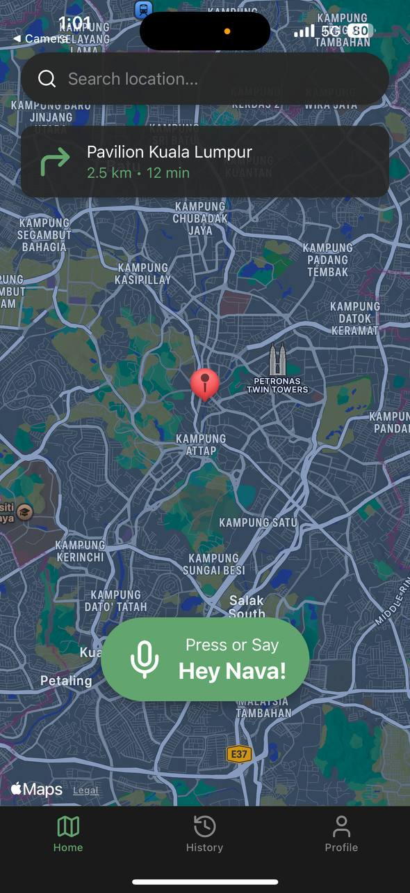
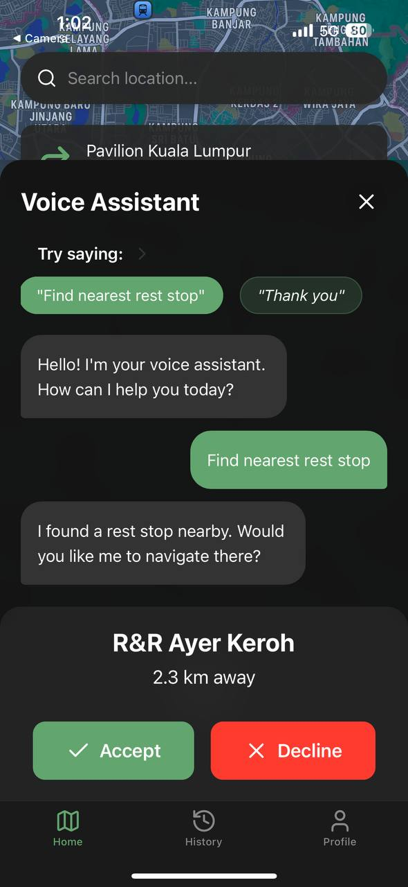

# NAV.AI

To address the limitations of AI assistant through text-based interfaces, which can be impractical and unsafe when they are actively driving. 

## Team Name : Kerisbyte

This project is made for UMHackathon 2025

## PRELIMINARY ROUND:

## Presentation link
[Canva Link](https://www.canva.com/design/DAGkSvW6UKw/9rjd987-8_XWgLw3vg56Ww/edit?utm_content=DAGkSvW6UKw&utm_campaign=designshare&utm_medium=link2&utm_source=sharebutton)

## NLP Prototype Demonstration Github Repository
[Nav AI NLP prototype design](https://github.com/Thafoxes/NAV-AI-NLP-Prototype-design)

[DeepFilterNet2](https://huggingface.co/spaces/hshr/DeepFilterNet2)

## FINAL ROUND:

## Presentation Link
[Canva Link](https://www.canva.com/design/DAGlDaVVvBE/ir7WLMOQLILlPUpHvZGVmA/edit?utm_content=DAGlDaVVvBE&utm_campaign=designshare&utm_medium=link2&utm_source=sharebutton) (PDF uploaded at above [NAV.AI.pdf] )

Documentation uploaded at above [Documentation Final Round.pdf]

# About This Project

### Technology Used
- Deepfilternet [DeepFilterNet2](https://huggingface.co/spaces/hshr/DeepFilterNet2)
- Whisper
- LLaMa 3.2
- Bolt.new for prototyping
- React native
- Google console cloud

